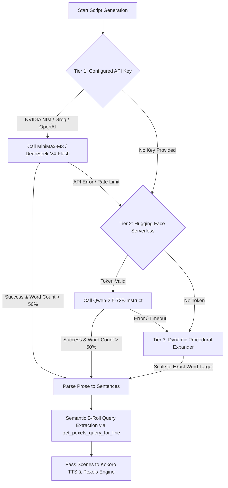

# EpicSync Video Automation System - Comprehensive Project Handoff

> **Version:** 2.0.0 (Production Scaled)  
> **Last Updated:** August 2026  
> **Repository:** `Airpyk-98/epic-yt-gabriel`  
> **Live Web App:** `https://epic-yt-gab.web.app`

---

## 1. Executive Summary & Purpose

**EpicSync** is an autonomous, cloud-native video generation platform capable of producing fully produced, broadcast-ready vertical (9:16 Shorts/Reels/TikTok) and horizontal (16:9 Documentary/Explainer) videos from a single title or prompt.

The platform handles the entire production lifecycle:
1. **AI Scriptwriting & Pacing**: Crafts viral short-form hooks or multi-chapter documentary scripts calibrated to exact word-count budgets (30s up to 30+ minutes).
2. **Audio Narration & Alignment**: Generates human-grade speech via Kokoro-82M neural TTS and transcribes word-level timestamps using OpenAI Whisper.
3. **Automated B-Roll Curation**: Dynamically extracts visual search queries and fetches synchronized HD stock clips from Pexels.
4. **Motion Subtitles & Audio Mixing**: Burns glowing ASS karaoke captions, layers background music (BGM) with automated voice ducking, and renders the final video.
5. **Storage, Sync & YouTube Publishing**: Stores outputs on Hugging Face CDN, syncs real-time job progress to Google Cloud Firestore, and automatically publishes completed videos to YouTube via Google OAuth 2.0.

---

## 2. End-to-End System Flow Architecture

```mermaid
sequenceDiagram
    autonumber
    actor Creator as Content Creator (Web UI)
    participant UI as Frontend (index.html / shared.js)
    participant FS as Google Cloud Firestore
    participant KG as Kaggle On-Demand GPU Worker
    participant Pexels as Pexels Video API
    participant HF as Hugging Face Dataset (CDN)
    participant YT as YouTube Data API v3

    Creator->>UI: Input Titles, Select Duration (e.g. 20 mins), Voice & BGM
    Creator->>UI: Click "Launch On-Demand Worker"
    UI->>FS: Create Job Document (status: "QUEUED", progress: 0)
    UI->>KG: Push Standalone Python Worker Script via Kaggle API
    
    rect rgb(30, 41, 59)
        note over KG: Execution on Kaggle T4 GPU
        KG->>KG: 1. Generate Script (MiniMax-M3 / DeepSeek-V4-Flash)
        KG->>KG: 2. Voiceover Synthesis (Kokoro-82M TTS -> audio.wav)
        KG->>KG: 3. Word-Level Timestamp Alignment (OpenAI Whisper -> subs.ass)
        KG->>Pexels: 4. Fetch Stock Video Streams (with Query Cache)
        KG->>KG: 5. FFmpeg Assembly (Concat B-roll + Karaoke Subtitles + Mixed BGM)
        KG->>KG: 5.5 Retime Speed (setpts + atempo if video_speed != 1.0)
        KG->>HF: 6. Upload final MP4 to dataset repo (epic-gab/EpicSync-Dataset)
    end

    HF-->>KG: Return Direct Media CDN URL
    KG->>FS: PATCH /users/{uid}/executions/{job_id} (status: "COMPLETED", output_file: URL)
    FS-->>UI: Real-Time onSnapshot Event
    UI->>Creator: Video Card Updates with Thumbnail & "Preview" Modal
    
    opt Auto-Post to YouTube Enabled
        UI->>UI: Check YouTube OAuth Access Token
        UI->>YT: Upload MP4 with Generated Title & Metadata
        UI->>FS: Update yt_upload_status: "SUCCESS"
    end
```



---

## 3. Technology Stack Matrix

| Layer | Technology | Role / Purpose |
| :--- | :--- | :--- |
| **Frontend UI** | HTML5, Modern CSS / Tailwind, ES Modules | Responsive Creator Studio, Settings, Logs, and YouTube Manager. |
| **Authentication** | Firebase Auth (Google OAuth 2.0) | Secure user authentication and YouTube API access token delegation. |
| **Database** | Google Cloud Firestore | Real-time state synchronization, execution tracking, and user preferences. |
| **Hosting** | Firebase Hosting (`cleanUrls`, CDN caching) | Global delivery of static web assets (`epic-yt-gab.web.app`). |
| **Compute Engine** | Kaggle GPU Workers (`kaggle/kernels/push`) | Serverless on-demand execution on NVIDIA T4 GPUs for video rendering. |
| **Speech Engine** | Kokoro-82M Neural TTS & Edge-TTS | High-fidelity, emotional voiceover synthesis with speed/pitch control. |
| **Audio Alignment** | OpenAI Whisper | High-accuracy word-level audio alignment for synchronized karaoke captions. |
| **Video Processing & Retiming** | FFmpeg 6.0+ | Clip scaling/cropping, ASS subtitle burning, audio normalization (`amix`), and dynamic speed multiplier retiming (`setpts` + `atempo`). |
| **Stock Assets** | Pexels Video API | Dynamic retrieval of HD portrait (1080x1920) and landscape (1920x1080) footage. |
| **Cloud Storage** | Hugging Face Datasets (`huggingface_hub`) | Permanent storage and low-latency global CDN streaming for rendered videos. |
| **Primary LLMs** | `minimaxai/minimax-m3`, `deepseek-ai/deepseek-v4-flash-0731` | High-retention psychological scriptwriting and documentary essay generation. |

---

## 4. Script Generation & Duration Scaling Model

The system enforces a strict spoken pacing model calibrated to natural speech (**140 words per minute** / **~2.33 words per second**).

```
Target Spoken Words = Duration in Seconds × 2.33
Strict Word Window = [Target × 0.90, Target × 1.15]
```

### Duration & Word Budget Table

| Target Duration | Total Seconds | Target Word Count | Target Chapters | Words / Chapter | Pipeline Flow |
| :---: | :---: | :---: | :---: | :---: | :--- |
| **30 seconds** | 30s | ~70 words | 1 | ~70 | Shorts Viral Hook |
| **45 seconds** | 45s | ~105 words | 1 | ~105 | Shorts Viral Hook |
| **60 seconds** | 60s | ~140 words | 1 | ~140 | Shorts Viral Hook |
| **3 minutes** | 180s | ~420 words | 3 | ~140 | Chaptered Explainer |
| **5 minutes** | 300s | ~700 words | 3 | ~233 | Chaptered Explainer |
| **10 minutes** | 600s | ~1,400 words | 5 | ~280 | Documentary Essay |
| **20 minutes** | 1,200s | ~2,800 words | 10 | ~280 | Full Documentary |
| **30 minutes** | 1,800s | ~4,200 words | 15 | ~280 | Feature Video Essay |

### Multi-Tier AI Fallback Architecture



---

## 5. Media Pipeline & Subtitle Specifications

### 1. Karaoke Subtitle Styling (`subs.ass`)
- **Format**: Advanced SubStation Alpha (`.ass`)
- **Effects**: Word-by-word karaoke highlight (`\k` timing tags) with secondary outline and dropshadow.
- **Customizable**: Color (e.g. `#FFDD00` Gold), Font Size (`55px`), and Vertical Offset (`82%` from top).

### 2. Audio Processing & Normalization
- **Speech**: Synthesized at 24kHz, normalized with voice boost volume filters (`volume=1.20`).
- **Background Music**: Looped seamlessly across long durations, mixed with voiceover via:
  ```bash
  amix=inputs=2:duration=first:dropout_transition=2,volume=2.0
  ```
- **Conforming**: Standardizes audio to dual-channel AAC at 192kbps.

### 3. Video Conforming & Concatenation
- **Aspect Ratios**: 9:16 (`1080x1920`) for vertical or 16:9 (`1920x1080`) for horizontal.
- **Filters**: `scale=W:H:force_original_aspect_ratio=increase,crop=W:H,setsar=1`.
- **Query Caching**: In-memory `pexels_query_cache` prevents redundant HTTP calls across 100+ scenes.

---

## 6. Repository & File Inventory

```
├── .firebase/                     # Firebase CLI hosting cache
├── api/
│   └── launch.py                 # Serverless API fallback launcher for batches
├── data/
│   └── firebase_admin.json       # Admin credentials for backend sync
├── public/
│   ├── audio/                    # Bundled royalty-free BGM tracks (.mp3)
│   │   ├── ambient_synth.mp3
│   │   ├── dark_suspense.mp3
│   │   ├── dramatic_piano.mp3
│   │   ├── lofi_chill.mp3
│   │   └── upbeat_tech.mp3
│   ├── index.html                # Main Creator Studio dashboard
│   ├── login.html                # Authentication & registration portal
│   ├── logs.html                 # Real-time execution monitor & video player
│   ├── settings.html             # API keys, voice defaults & YouTube OAuth manager
│   ├── shared.js                 # Core engine, worker generator, and dispatch logic
│   ├── style.css                 # Universal styling & dark/light theme tokens
│   └── yt_logs.html              # Dedicated YouTube upload monitor
├── firebase.json                 # Firebase Hosting & Firestore deployment configuration
├── firestore.rules               # Firestore security rules
├── kaggle_12hr_worker.py         # Polling-based background worker (Legacy/Optional)
├── main.py                       # FastAPI local backend & webhook runner
├── run_batch_on_kaggle.py        # CLI tool for launching Kaggle workers
└── HANDOFF.md                    # This master project handoff documentation
```

---

## 7. Operational & Deployment Guide

### A. Deploying Frontend Updates (Firebase Hosting)
```powershell
# From the project root:
firebase deploy --only hosting
```
The live web application is hosted at: `https://epic-yt-gab.web.app`

### B. Committing Changes to GitHub
```powershell
git add -A
git commit -m "Your descriptive commit message"
git push origin main
```

### C. Launching a Video Generation Batch
1. Open `https://epic-yt-gab.web.app` in your browser.
2. Sign in with your Google account.
3. In the **Batch Generation** panel:
   - Enter your video titles (one per line).
   - Select your desired duration (e.g. `20 minutes`, `5 minutes`, `45 seconds`).
   - Select your aspect ratio (`9:16` or `16:9`), voice (`am_adam`), BGM track, and captions color.
4. Click **"Launch On-Demand Worker"**.
5. Watch live progress in the **Active Executions** tab. When complete, click the video card to preview or download the final HD video!
